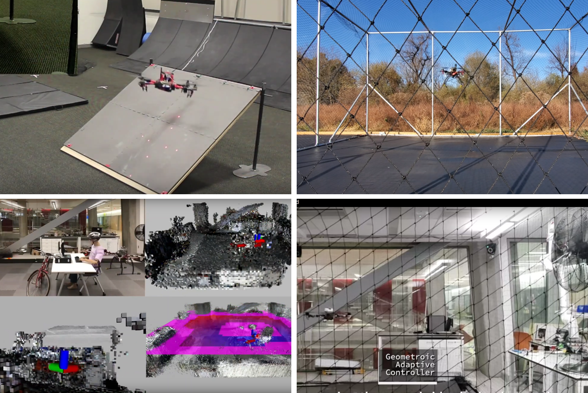

# Geometric Control of a Quadrotor UAV on SE(3)

<center>
  
</center>

This includes the geometric controller in SE(3) we use in the Flight Dynamics and Control Lab, in different programming languages.
We use two main versions of the controller:
1. [Geometric tracking control of a quadrotor UAV on SE(3)](https://arxiv.org/pdf/1003.2005.pdf).
2. [Geometric Controls of a Quadrotor with a Decoupled Yaw Control](https://doi.org/10.23919/ACC.2019.8815189)

The main difference between those two is that the second one decouples the yaw control in the attitude controller.
This leads to better tracking performance, especially at the presence of large yaw angles, but at the expense of some additinal computations and slightly delayed yaw error convergence.
Please check [Geometric Controls of a Quadrotor with a Decoupled Yaw Control](https://doi.org/10.23919/ACC.2019.8815189) for more comparisons.

Variants of both the controllers have been used in various numerical and experimental research tasks.
A summary of these can be found in [Publications](#publications) section.

----
## Codes in this Repository

The following controller/language combinations are available in this repository.
The documenteds for some of the languages can be found [here](https://fdcl-gwu.github.io/uav_geometric_control/).
Other languages are documented directly in the source files.

Language | Standard [1] | Decoupled-Yaw [2]
--------|--------|---------
C++ |  :white_check_mark: |  :white_check_mark:
Python |  :white_check_mark: | :white_check_mark:**
Matlab |  :white_check_mark: |  :white_check_mark:

Note:
* You can find the ROS/Gazebo simulation environment [here](https://github.com/fdcl-gwu/uav_simulator.git).
* Python decoupled-yaw controller can be found in the ROS/Gazebo repository.**
* Documentation for the C++ is inside the `cpp` directory.
* Unit testing has been implemented in C++ and Python (partial) versions of the controller.

----
## Citations

If you use either of the controllers, please use the relevant citatations:
* Geometric tracking control of a quadrotor UAV on SE(3):
  ```
  @inproceedings{Lee2010,
  author={T. {Lee} and M. {Leok} and N. H. {McClamroch}},
  booktitle={IEEE Conference on Decision and Control}, 
  title={Geometric tracking control of a quadrotor UAV on SE(3)}, 
  year={2010},
  pages={5420-5425},}
  ```
* Geometric Controls of a Quadrotor with a Decoupled Yaw Control
  ```
  @inproceedings{Gamagedara2019,
    title={Geometric controls of a quadrotor uav with decoupled yaw control},
    author={Gamagedara, Kanishke and Bisheban, Mahdis and Kaufman, Evan and Lee, Taeyoung},
    booktitle={2019 American Control Conference (ACC)},
    pages={3285--3290},
    year={2019},
    organization={IEEE}
  }
  ```
  
----
## Publications

A selected list of publications that use implementations of the above controllers with/without slight variations:
* Geometric adaptive controls of a quadrotor UAV with decoupled attitude dynamics: [paper](https://doi.org/10.1115/1.4052714), [repo](https://github.com/fdcl-gwu/decoupled-yaw-controller-comparison), [video](https://youtu.be/w4UcEp5jb0E)
* Geometric controls of a quadrotor with a decoupled yaw control:  [paper](https://ieeexplore.ieee.org/document/8815189)
* Geometric adaptive control with neural networks for a quadrotor UAV in wind fields(wind rejection): [paper](https://ieeexplore.ieee.org/document/8619390), [ArXiv link](https://arxiv.org/pdf/1803.06363.pdf), video: [360 back-flip](https://www.youtube.com/watch?v=a-DG2PcUu7k), [hover flight](https://www.youtube.com/watch?v=ouSsrDfi8DM), [attitude flight](https://www.youtube.com/watch?v=zUsOif1SfEs)
* Autonomous quadrotor 3D mapping and exploration using exact occupancy probabilities: [video](https://youtu.be/2Q2_-d8kNu0)
* Autonomous flight of a quadrotor UAV with the states estimated by a delayed Kalman filter: [video](https://youtu.be/9e71BL-I07E)
*  Laser guided landing on an inclined surface: [paper](http://dx.doi.org/10.2514/1.G001229), [video](https://youtu.be/Tx_WsYDYz7g)
* PID Geometric control on SE(3): [paper](https://ieeexplore.ieee.org/abstract/document/6669644), [ArXiv link](https://arxiv.org/pdf/1304.6765.pdf)
* Geometric control on SE(3): [paper](https://ieeexplore.ieee.org/abstract/document/5717652)
* Geometric attitude control on SO(3): [paper](https://ieeexplore.ieee.org/abstract/document/6291756)
* Model identification on SE(3): [paper](https://ieeexplore.ieee.org/document/8062614)
* Model identification on SO(3): [paper](https://link.springer.com/content/pdf/10.1007/s12555-016-0714-2.pdf)
* Attitude Control on SO(3) with constraints: [paper](https://shankarkulumani.com/2016/08/2016ACC.html), [Code](https://github.com/fdcl-gwu/2016_ACC_matlab)
* For a rigid dumbbell around an asteroid: [code](https://github.com/fdcl-gwu/asteroid_dumbbell)


----
## Generating the Documentation
### C++
1. Switch to the docs branch: `git checkout docs`
1. If you update the code in the `master` branch, merge it to the `docs` branch: `git merge master`
1. Change the directory to docs directory: `cd docs/cpp/`
1. Make sure all the dependencies are installed:
    ```sh
    # Linux
    sudo apt-get install -y doxygen graphviz

    # Mac
    brew install graphviz doxygen
    ```
1. Generate the documentation: `doxygen Doxygen`